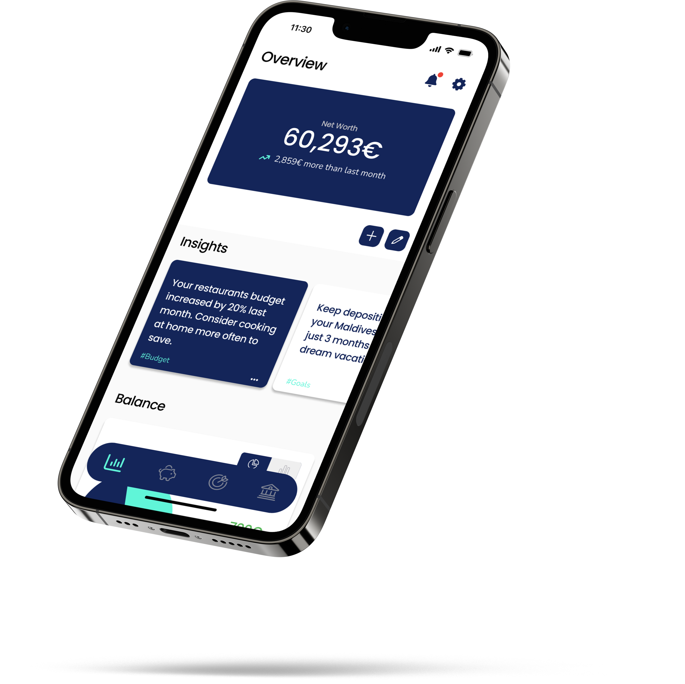
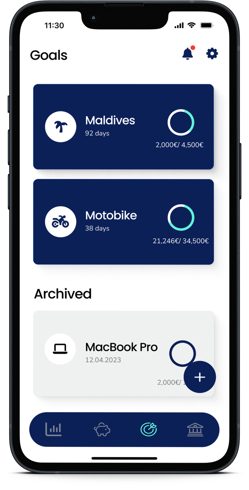
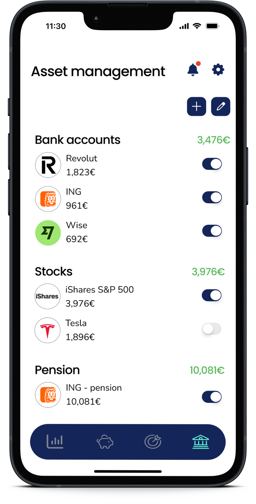
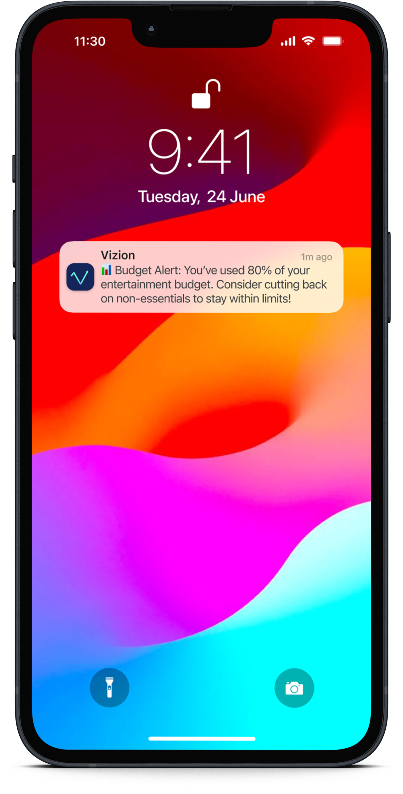

# 📊 Vizion – Personal Finance Management App  

**Vizion** is a full-stack personal finance management app designed to help users take control of their money by providing a **clear overview** of their financial situation. With Vizion, users can **track expenses, set financial goals, and make informed financial decisions**. The app consolidates financial data from multiple sources, delivers personalized insights, and offers a seamless user experience for **budgeting and planning**.  [Full project report](public/vizion_report.pdf)

---

## ✨ Project Overview  

Developed as my **final project**, this application covers the **entire product development lifecycle**, including:  

✅ **Research & UX Research**  
✅ **Market & Business Strategy**  
✅ **UI/UX Design & Prototyping**  
✅ **Frontend & Backend Development**  

---

## ✨ Key Features  

🔹 **Financial Overview** – Track balances, transactions & net worth  
🔹 **Expense Tracking** – Categorize expenses & monitor spending habits  
🔹 **Goal Setting** – Set & track financial goals (vacation, car, home, etc.)  
🔹 **Budgeting Tools** – Create personalized budgets & receive spending insights  
🔹 **Analytics & Insights** – Interactive charts for better financial planning  
🔹 **Notifications & Alerts** – Get reminders & personalized financial tips  

---

## 🛠️ Technologies Used  

### **Frontend & Backend**  
  
  
  
  
### **Database**  
  
### **Development & Deployment**  
  
  
  
  
### **Additional Tools**  
  
  
### **Design Tools**  
  

[Overview demo](https://files.catbox.moe/6d98pa.MP4)
[Budget demo](https://files.catbox.moe/jnt5ru.MP4)

